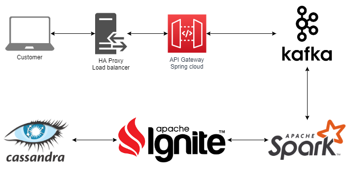

# Software Engineer Challenge

2. Design Question: Design A Google Analytic like Backend System.
    We need to provide Google Analytic like services to our customers. Pls provide a high level solution design for the backend system. Feel free to choose any open source tools as you want.
	
The system needs to:

1) handle large write volume: Billions write events per day.
	
2) handle large read/query volume: Millions merchants want to get insight about their business. Read/Query patterns are time-series related metrics. 
	
3) provide metrics to customers with at most one hour delay.
	
4) run with minimum downtime.
	
5) have the ability to reprocess historical data in case of bugs in the processing logic.

##**Design proposed

For a more reliable, scalable and fast. This backend system design is base on the following technologies:

- [ ] **HAProxy (Load balancer):

	HAProxy will allow to do failover and replication. This can be on data, services and infrastructure.

- [ ] **Spring cloud (API gateway):

	Spring cloud will receives all the requests coming from the UI and then delegates the requests to internal microservices, REST API or WS. 

- [ ] **Apache Kafka streams (messaging system):

	Apache Kafka streams  is run as a cluster on one or more servers that can span multiple datacenters, and will manage event per message, communicating services (client-server).

- [ ] **Apache Spark (time-series data processing):

	Apache Spark is an in-memory engine proccesor. That allow multiple techs as ETL, analytics, ML and others.

- [ ] **Apache Ignite (In-memory database):

	Apache Ignite is a in-memory database stored, that allows ad hoc transactions. And finally persist data after processed on database.

- [ ] **Cassandra (persistent database):

	Cassandra is engine database to persist and stored. Highly scalable and fully distributed.

